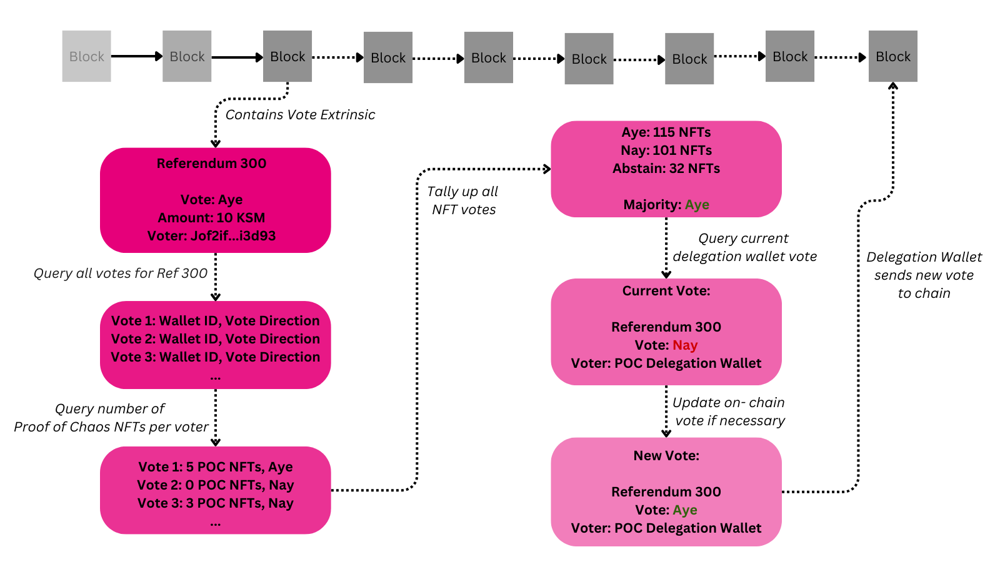

# Proof of Chaos Delegation Program

Proof of Chaos Delegation Program enhances voting power in governance processes by leveraging the influence of Proof of Chaos NFT holders. This program aims to empower those most invested in governance decisions.

## Features

Whenever there is an on-cahin vote, this program does the following:
- Retrieves IDs of all Proof of Chaos NFTs using an indexer.
- Retrieves all votes for the respective referendum that was just voted.
- Queries number of POC NFTs for each voter.
- Tallys votes (ayes, nays, abstains).
- Reads governance votes from the delegated wallet.
- Automatically adjusts delegated wallet vote for respective refereundum if current on-chain vote doesn't align with new majority consensus of NFT holders.



## Concept

This program revolutionizes active governance participation by granting more voting power to dedicated community members. It operates a Delegation wallet controlled by NFT holders, enhancing democratic decision-making in the community. All processes are automated, requiring no extra effort from NFT holders, ensuring a seamless governance experience.

## Installation

To install this program:

1. Clone the repository:
   ```bash
   git clone https://github.com/Proof-Of-Chaos/delegation_bot.git
   ```
2. Navigate to the project directory:
   ```bash
   cd delegation_bot
   ```
3. Install dependencies:
   ```bash
   npm install
   ```
4. Set up your `.env` file based on the `.env-sample` provided in the repository.

## Usage

The program runs seamlessly in the background. NFT holders can vote normally on chain, and the bot will automatically process these votes, influencing the delegation wallet. All background processes are handled without any need for direct interaction from NFT holders. A user interface will be incorporated into our website soon to enhance interaction and visibility.

## Contributing

We welcome contributions. Please follow the standard fork, branch, and pull request workflow.

## License

This project is licensed under [appropriate license].

## Contact

For queries or feedback, please reach out to [contact information].